# Install Slicing Software Cura

1. Download Cura 5 from the Link 🌍 [here](https://ultimaker.com/de/software/ultimaker-cura)
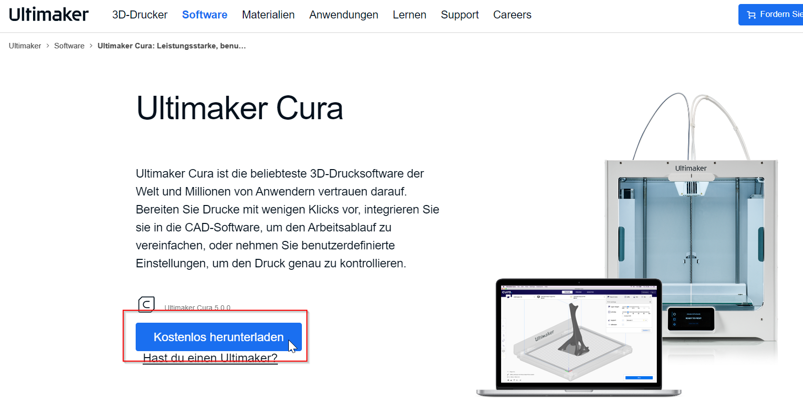
2. **Install it** and close the programm if it opened automatically.

---

# Install the provided custom config files

Cura does not come with pre-defined configs for the printer and does not have proper printing presets 😥, this is why you have to get the ones from this repository, which i created myself 👍.

## The easy way

1. Download the repository files 🌍[here](https://github.com/SenpaiSimon/Ender3-S1-Pro/archive/refs/heads/main.zip)
2. Extract the whole archive with your chosen ZIP-Viewer 🪄
3. Double click on the `install.bat` - file
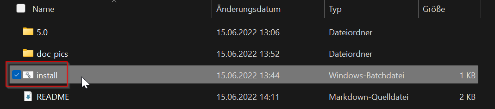  
  

Now you are done! 👌

## The alternative way

1. Press "Windows + R" on your Keyboard and enter %appdata% and press Enter
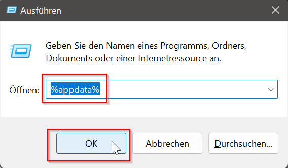
2. Navigate to "cura"
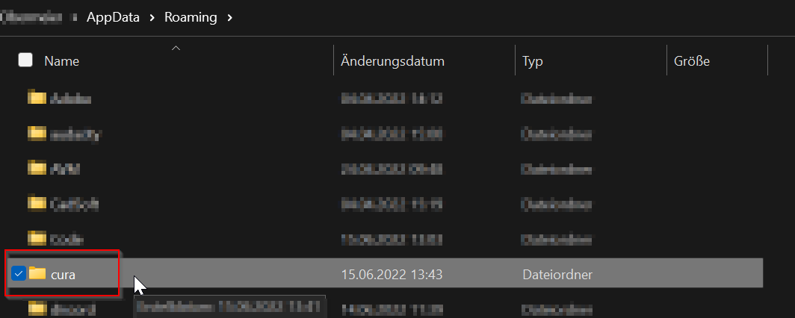
3. Download the repository files 🌍[here](https://github.com/SenpaiSimon/Ender3-S1-Pro/archive/refs/heads/main.zip)
4. Extract the whole archive with your chosen ZIP-Viewer 🪄
5. Replace the "5.0" Folder with the "5.0" Folder of the repository
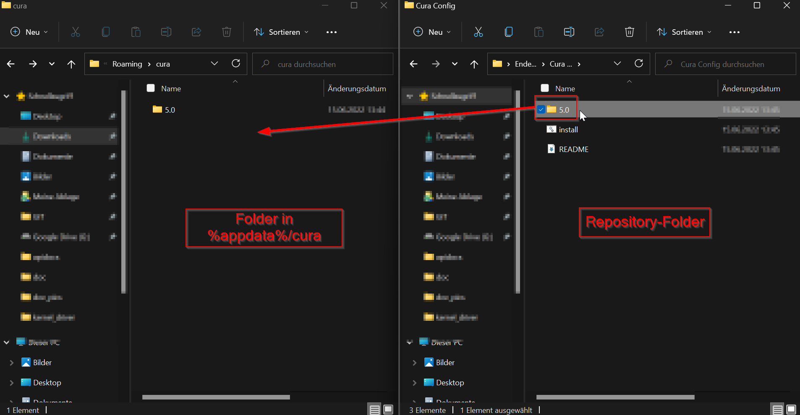
6. If windows ask if you want to replace files, just replace all

Now you are done! 👌

---

# The Cura UI

First you can check whether the installation of the Config was done right ✅

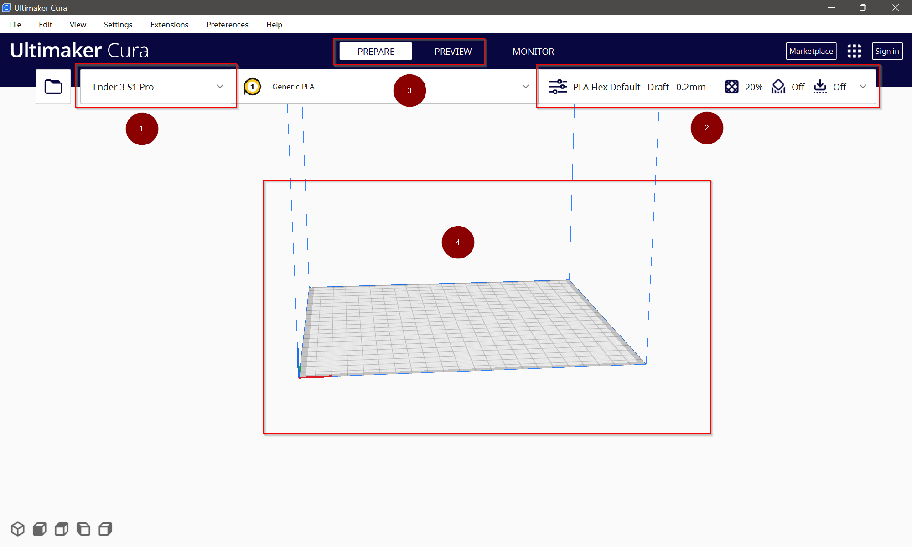

1. The Printer selection, this profil should already be selected
2. The Quality settings for the prints
3. The Prepare and Show Tab
4. Drag and drop your `.stl`-files in here while in "Prepare" tab

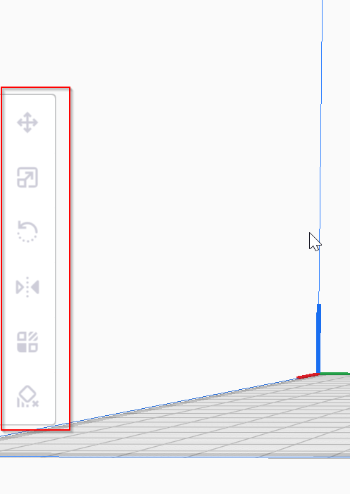

With these you can modify the placement of your files on the printbed. 
From top to bottom:
1. Move the part in x,y,z directions
2. Scale the parts
3. Rotate the parts
4. Mirror Parts
5. Modify Settings for specific part
6. Add a support blocker

---

Be careful with orienting the parts 🛑 They have to be printable! The Printer can not print into thin air!  

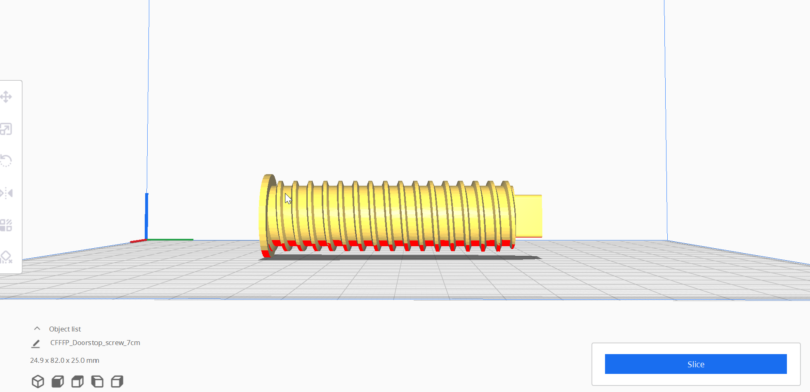

This is really bad placement for the part. The whole middle section is hovering.

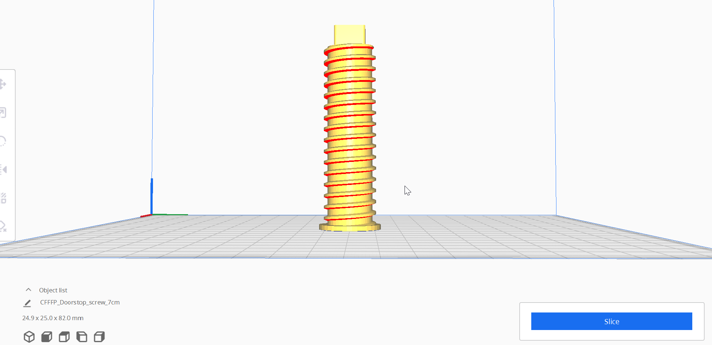

With just some light modifications we can overcome this issue without using any support structures.
   
  
If you finished placing your parts, you can select a profile on the right side of the window 🖥️.

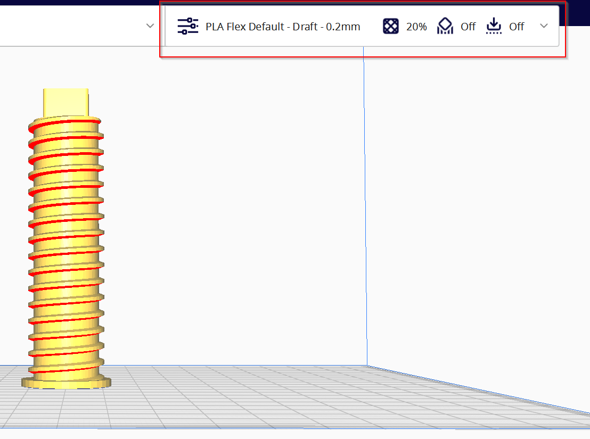

When you open up the dropdown, you will see a ton of options on how you can adjust the print. 

> First enable all options by clicking here...
> 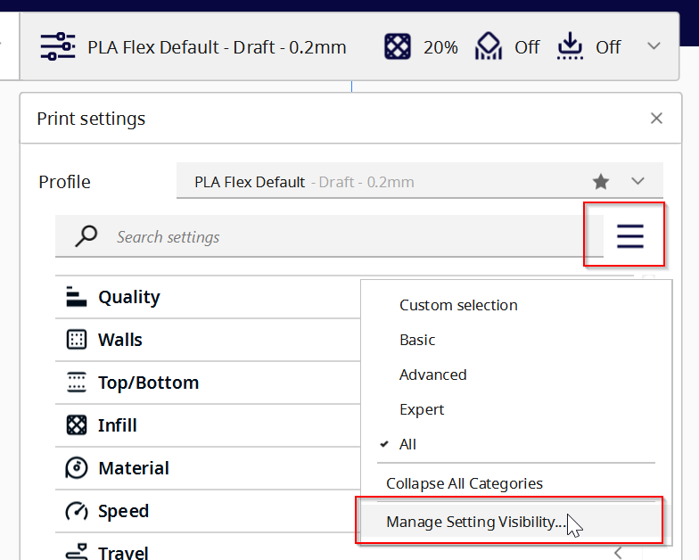
> In the following window press...
> 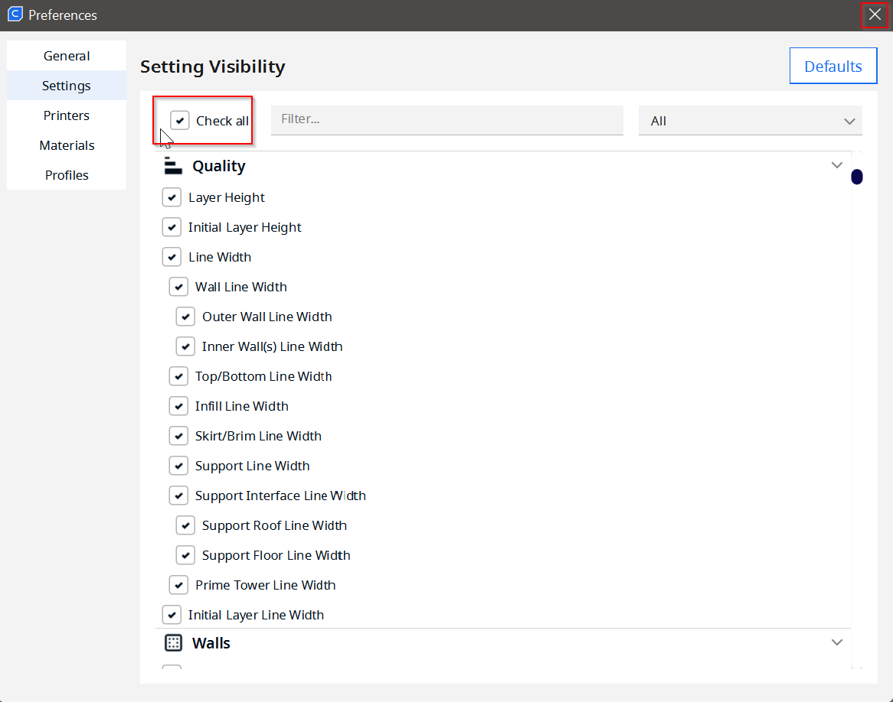
> now you can close this window again and you will see all options

For most of the prints you can leave all these settings untouched and select one of the profiles which i created ✅

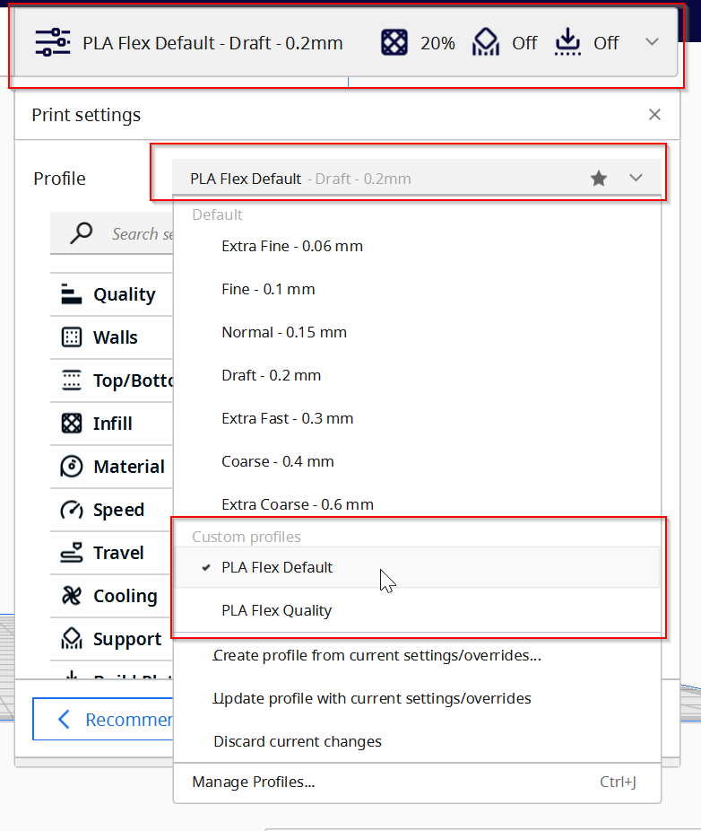

The upper options are from Cura itself and will not work for printing. Just use one of the Options listed under `Custom Profiles` ⚒️

Currently there are two profiles added for this printer.
 - "PLA Flex Default" - which prints faster and is enough for nearly all prints
 - "PLA Flex Quality" - which prints a lot finer und slower, for a lot more details

Afterwards you can press "Slice" 🪚 in the bottom right and wait for it to be done.

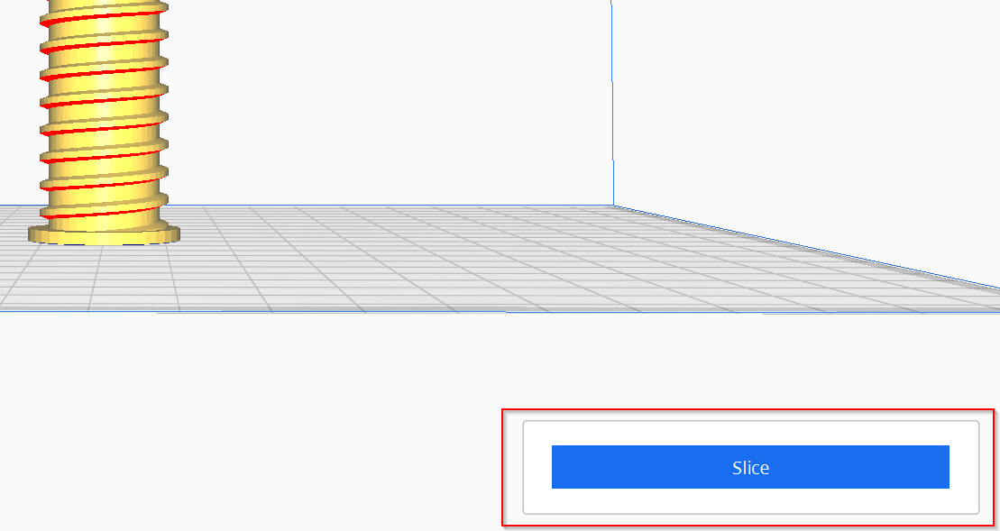

Now you can see a some valuable information about the print.

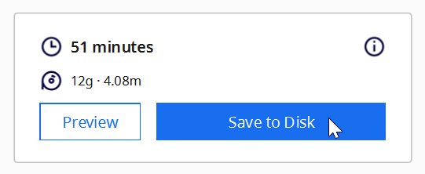

You can see an estimate about how long ⏲️ the print will take and how much filament 🏋️‍♂️ will be used.

Before Saving, you can give a name ✒️ to the file which is about to be saved. This is done here... 

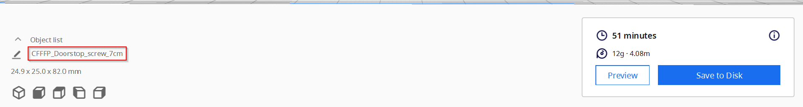

If you have a SD-Card plugged into your PC before pressing `slice` you will have the option to not use the `Save to Disk` Button, but a `Save to removeable` button will appear.

Now you can plug the SD-Card into the printer 🖨️ and start the print.

--- 

# Patience 💭

Be patient for the print to start! It will heat up all the components first and the perform a self calibration before each print. This can take some time, so do not panik.