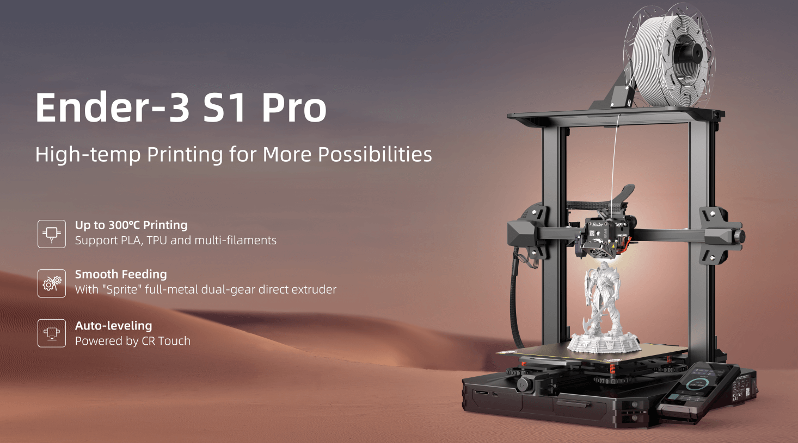

# Ender 3 S1 Pro on Cura

  

---

# Setting up the printer for your PC

For that you have to look into the Config Section of this Repository and follow the [README](https://github.com/SenpaiSimon/Ender3-S1-Pro/tree/main/Cura%20Config) there.  
  
You can also just click here: [click](https://github.com/SenpaiSimon/Ender3-S1-Pro/tree/main/Cura%20Config)

---

# Information on the Printer

Here is some useful information you might want to know about this machine.

| Spec | Info | 
| --- | --- | 
| Max Hotend Temp | 300°C |
| Max Bed Temp | 110°C |
| Max print Volume | 220x220x270mm | 
| Direct Drive | yes |
| Filament Runout Detection | yes |
| Detachable Bed | yes | 
| Light up Bed | yes |
| Dual Z Axis | yes | 

# Marlin 

I might add a custom firmware for this printer to make it more customizable. But currently there is no real need for it, so i will not bother to create it properly.

---

# TODO

- Add Support Settings to profiles